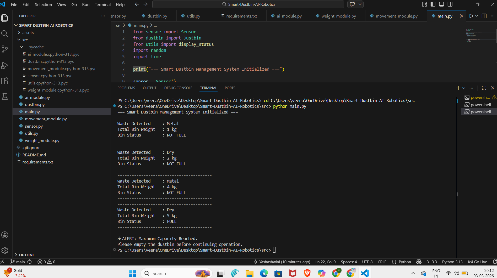

# Smart Waste Management System (AI Simulation)


##  Overview
Smart Waste Management System is a Python-based simulation of an intelligent dustbin system.

The system detects waste type, monitors bin weight, and alerts when the bin reaches maximum capacity.

This project demonstrates modular programming, system monitoring, and basic AI-inspired simulation logic.

---

## Key Features
- Waste Type Detection (Wet / Dry / Metal)
- Real-Time Weight Monitoring
- Automatic Full Bin Alert
- Clean Modular Code Structure
- Professional Terminal Output Display

---

## Technologies Used
- Python
- Object-Oriented Programming (OOP)
- Random Module (Simulation)
- Time Module

---

## Project Structure

| File / Folder | Description |
|--------------|-------------|
| src/main.py | Main program controller |
| src/sensor.py | Simulates waste detection |
| src/dustbin.py | Handles bin capacity logic |
| src/utils.py | Displays formatted output |
| assets/ | Stores screenshots |
| README.md | Project documentation |

---

## How to Run

1. Navigate to the `src` folder:
   ```bash
   cd src

## System Output Screenshot



---

## Author

Developed by V.Yashashwini 
GitHub: https://github.com/yashashwiniv-11

---

If you like this project, give it a star!